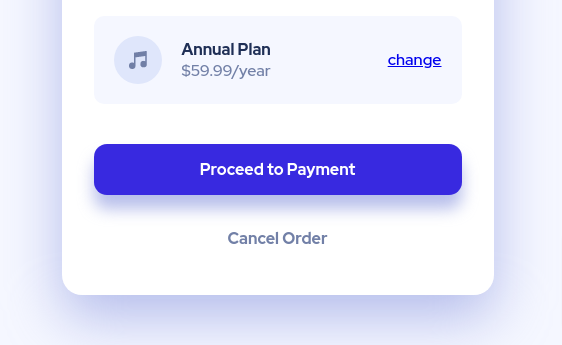
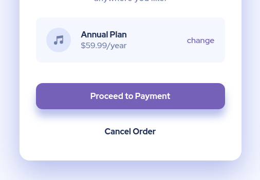

# Frontend Mentor - Order summary card solution

This is a solution to the [Order summary card challenge on Frontend Mentor](https://www.frontendmentor.io/challenges/order-summary-component-QlPmajDUj). Frontend Mentor challenges help you improve your coding skills by building realistic projects.

## Table of contents

- [Overview](#overview)
  - [The challenge](#the-challenge)
  - [Screenshot](#screenshot)
  - [Links](#links)
- [My process](#my-process)
  - [Built with](#built-with)
  - [What I learned](#what-i-learned)
  - [Continued development](#continued-development)
- [Author](#author)

## Overview

### The challenge

Users should be able to:

- See hover states for interactive elements

### Screenshot

- **default**
  
- **hover**
  

### Links

- Solution URL: [GitHub code](https://github.com/MateuszUrb/Order-summary-card)
- Live Site URL: [live demo](https://jovial-allen-483130.netlify.app/)

## My process

### Built with

- Semantic HTML5 markup
- CSS custom properties
- Flexbox

### Continued development

I want to focus more on the mobile-first approach, and make my RWD skills better

## Author

- GitHub - [@MateuszUrb](https://github.com/MateuszUrb)
- Frontend Mentor - [@MateuszUrb](https://www.frontendmentor.io/profile/MateuszUrb)
- Twitter - [@M_Urban98](https://twitter.com/M_Urban98)
